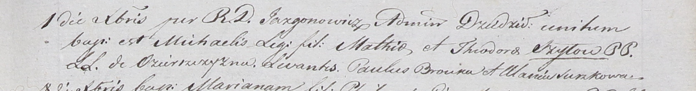

**Шило Михал Мацеев (Szyło Michael)**

1 декабря 1801 г -- крещение (НИАБ 937-4-32, лист 5, №27/1801-р).

**НИАБ 937-4-32:** Лист 5. **Метрическая запись №27/1801-р.**

{width="6.496527777777778in"
height="0.8541666666666666in"}

Дедиловичский костел Наисвятейшего Сердца Иисуса. 1 декабря 1801 года.
Метрическая запись о крещении.

Szyło Michaelis -- сын крестьян с деревни Озерщизна.

Szyło Mathias -- отец.

Szyłowa Theodora -- мать.

Brouka Paul -- крестный отец.

Suszkowa Ulana? -- крестная мать.

Jazgunowicz Antoniusz -- ксёндз, администратор Дедиловичской униатской
церкви.
