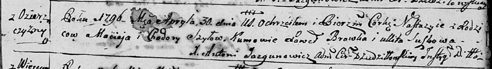

**Шило Настасья Мацеева (Szyłowna Nastazyia)**

30 апреля 1796 г -- крещение (НИАБ 136-13-894, лист 14, №40/1796-р
(ориг)).

Лист 29. **Метрическая запись №40/1796-р (ориг).**

Дедиловичская Покровская церковь. 30 апреля 1796 года. Метрическая
запись о крещении.

Szyłowna Nastazyia -- дочь родителей с деревни Озерщизна.

Szyło Maciey -- отец.

Szyłowa Chodora -- мать.

Browka Paweł - кум.

Suszkowa Ullita - кума.

Jazgunowicz Antoni -- ксёндз.
