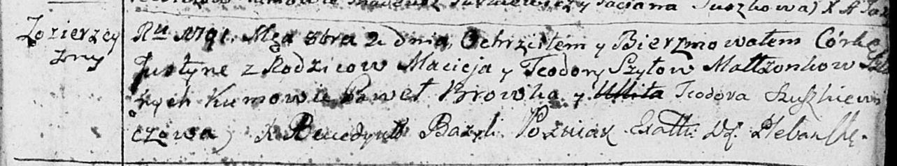
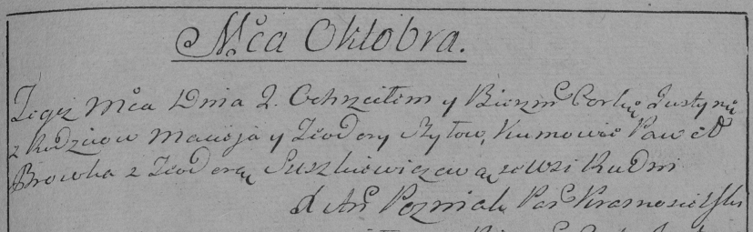

**Шило Юстына Мацеева (Szyłowna Justyna)**

2 октября 1791 г -- крещение (НИАБ 136-13-894, лист 14, №47/1791-р
(ориг)), (РГИА 823-2-18, лист 242, №24/1791-р (коп)).

**НИАБ 136-13-894:** Лист 14. **Метрическая запись №47/1791-р (ориг).**

Дедиловичская Покровская церковь. 2 октября 1791 года. Метрическая
запись о крещении.

Szyłowna Justyna -- дочь родителей с деревни Озерщизна.

Szyło Maciej -- отец.

Szyłowa Teodora -- мать.

Browka Paweł - кум.

Szuszkiewiczowa Teodora - кума.

Jazgunowicz Antoni -- ксёндз.

**РГИА 823-2-18:** Лист 243. **Метрическая запись №25/1791-р (коп).**

Дедиловичская Покровская церковь. 2 октября 1791 года. Метрическая
запись о крещении.

Szyłowna Justyna -- дочь родителей с деревни Рудня \[Озерщизна\].

Szyło Maciey -- отец.

Szyłowa Teodora -- мать.

Browka Paweł -- кум.

Suszkewiczowa Teodora - кума.

Jazgunowicz Antoni -- ксёндз.
