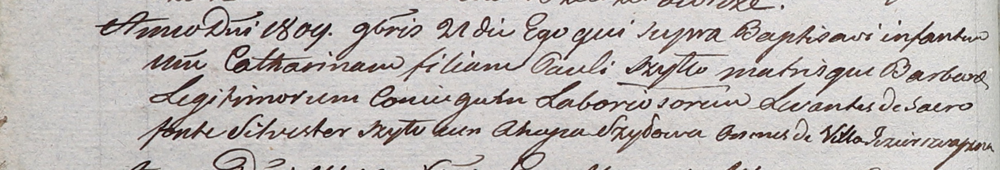

**Шило Павел (Szyło Paul)**

26 сентября 1807 г -- крещение дочери Марии (НИАБ 937-4-32, лист 16,
№17/1807-р).

21 ноября 1809 г -- крещение дочери Катарины (НИАБ 937-4-32, лист 20об,
№32/1809-р).

**НИАБ 937-4-32:** Лист 16. **Метрическая запись №17/1807-р.**

{width="6.496527777777778in"
height="2.1326388888888888in"}

Дедиловичский костел Наисвятейшего Сердца Иисуса. 26 сентября 1807 года.
Метрическая запись о крещении.

Szyłowna Maria -- дочь крестьян с деревни Озерщизна.

Szyło Paul -- отец.

Szyłowa Barbara -- мать.

Szyło Niciphor -- крестный отец.

Szyłowa Achapa -- крестная мать, с деревни Озерщизна.

Zychowski Gabriel -- ксёндз.

**НИАБ 937-4-32:** Лист 20об. **Метрическая запись №32/1809-р.**

{width="6.496527777777778in"
height="1.1090277777777777in"}

Дедиловичский костел Наисвятейшего Сердца Иисуса. 21 ноября 1809 года.
Метрическая запись о крещении.

Szyłłowna Catharina -- дочь крестьян с деревни Озерщизна.

Szyłło Paul -- отец.

Szyłłowa Barbara -- мать.

Szyło Silvester -- крестный отец, с деревни Озерщизна.

Szyłowa Ahapa -- крестная мать, с деревни Озерщизна.

Miszkun Marcus -- ксёндз, комендант Дедиловичский.
