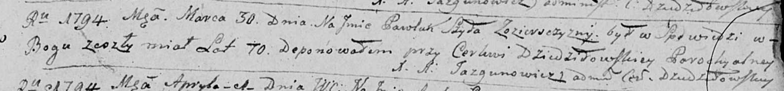

**Шило Павлюк (Szyło Pawluk)**

30 марта 1794 г -- отпевание, умер в возрасте 70 лет (родился около 1724
г) (НИАБ 136-13-919, лист 2, №21/1794-у (ориг)).

**НИАБ 136-13-919:** Лист 2. **Метрическая запись №21/1794-у (ориг).**

Дедиловичская Покровская церковь. 30 марта 1794 года. Метрическая запись
об отпевании.

Szyło Pawluk -- умерший, 70 лет, с деревни Озерщизна, похоронен при
церкви Дедиловичской.

Jazgunowicz Antoni -- ксёндз.
