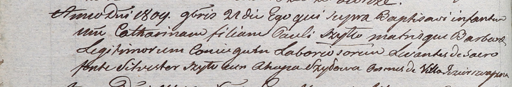

**Шило Сильвестер (Szyło Silvester)**

21 ноября 1809 г -- крестный отец Катарины, дочери Павла и Барбары Шил с
деревни Озерщизна (НИАБ 937-4-32, лист 20об, №32/1809-р).

**НИАБ 937-4-32:** Лист 20об. **Метрическая запись №32/1809-р.**

Дедиловичский костел Наисвятейшего Сердца Иисуса. 21 ноября 1809 года.
Метрическая запись о крещении.

Szyłłowna Catharina -- дочь крестьян с деревни Озерщизна.

Szyłło Paul -- отец.

Szyłłowa Barbara -- мать.

Szyło Silvester -- крестный отец, с деревни Озерщизна.

Szyłowa Ahapa -- крестная мать, с деревни Озерщизна.

Miszkun Marcus -- ксёндз, комендант Дедиловичский.
