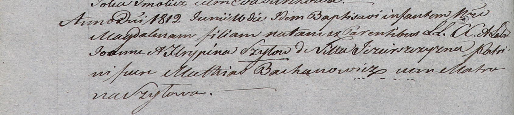
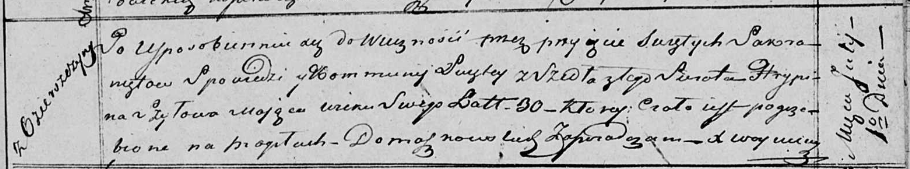

**Шило (Бровко) Грыпина (Szyłowa (Browkowna) Hrypina)**

6 ноября 1810 г -- венчание с молодым Яном Шило с деревни Озерщизна
(НИАБ 136-13-920, лист 16об, №5/1810-б (ориг)).

16 июня 1812 г -- крещение дочери Магдалины (НИАБ 937-4-32, лист 24об,
№15/1812-р).

1 июля 1818 г -- отпевание, умерла в возрасте 30 лет (родилась около
1788 г) (НИАБ 136-13-919, лист 32, №11/1818-у (ориг)).

**НИАБ 136-13-920:** Лист 16об. **Метрическая запись №5/1810-б (ориг).**

Осовская Покровская церковь. 6 ноября 1810 года. Метрическая запись о
венчании.

Szyło Jan -- жених, молодой, парафии Дедиловичской, с деревни Озерщизна.

Browkowna Hrypina -- невеста, с деревни Дедиловичи.

Sawicki Paweł -- свидетель.

Browka Paweł -- свидетель.

Woyniewicz Tomasz -- ксёндз.

**НИАБ 937-4-32:** Лист 24об. **Метрическая запись №15/1812-р.**

Дедиловичский костел Наисвятейшего Сердца Иисуса. 16 июня 1812 года.
Метрическая запись о крещении.

Szyłowna Magdalina -- дочь родителей с деревни Озерщизна.

Szyło Joann -- отец.

Szyłowa Hrypina -- мать.

Bachanowicz Mathias -- крестный отец.

Szyłowa Matruna -- крестная мать.

Zychowski Gabriel -- ксёндз.

**НИАБ 136-13-919:** Лист 32. **Метрическая запись №11/1818-у (ориг).**

Осовская униатская церковь. 1 июля 1818 года. Метрическая запись об
отпевании.

Szyłowa Hrypina -- умершая, 30 лет, с деревни Озерщизна, похоронена на
кладбище деревни Домашковичи.

Woyniewicz Tomasz -- ксёндз.
