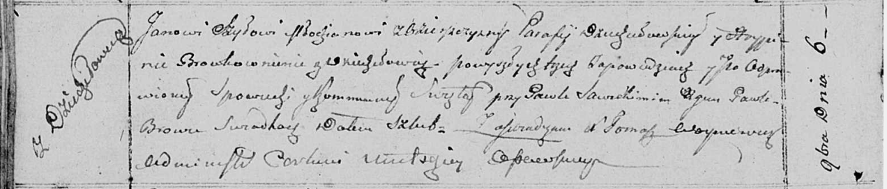
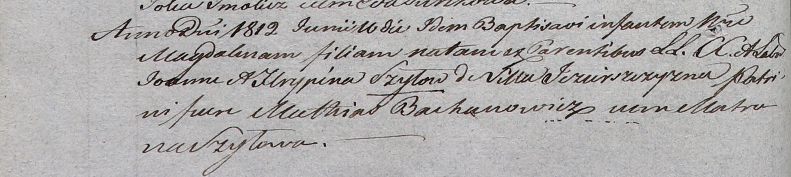

**Шило Ян (Szyło Jan)**

6 ноября 1810 г -- венчание с Грыпиной Бровко с деревни Дедиловичи (НИАБ
136-13-920, лист 16об, №5/1810-б (ориг)).

16 июня 1812 г -- крещение дочери Магдалины (НИАБ 937-4-32, лист 24об,
№15/1812-р).

**НИАБ 136-13-920:** Лист 16об. **Метрическая запись №5/1810-б (ориг).**

Осовская Покровская церковь. 6 ноября 1810 года. Метрическая запись о
венчании.

Szyło Jan -- жених, молодой, парафии Дедиловичской, с деревни Озерщизна.

Browkowna Hrypina -- невеста, с деревни Дедиловичи.

Sawicki Paweł -- свидетель.

Browka Paweł -- свидетель.

Woyniewicz Tomasz -- ксёндз.

**НИАБ 937-4-32:** Лист 24об. **Метрическая запись №15/1812-р.**

Дедиловичский костел Наисвятейшего Сердца Иисуса. 16 июня 1812 года.
Метрическая запись о крещении.

Szyłowna Magdalina -- дочь родителей с деревни Озерщизна.

Szyło Joann -- отец.

Szyłowa Hrypina -- мать.

Bachanowicz Mathias -- крестный отец.

Szyłowa Matruna -- крестная мать.

Zychowski Gabriel -- ксёндз.
