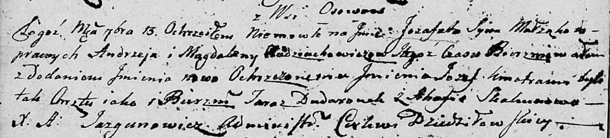

**Авдюхович Иозафат Андреев (Audziuchowicz Jozafat Jozef)**

13 сентября 1803 г -- крещение (НИАБ 136-13-894, лист 51об, №36/1803-р
(ориг)).

**НИАБ 136-13-894:** Лист 51об. **Метрическая запись №36/1803-р
(ориг).**

{width="6.496527777777778in"
height="1.4751126421697287in"}

Дедиловичская Покровская церковь. 13 сентября 1803 года. Метрическая
запись о крещении.

Audziuchowicz Jozafat Jozef -- сын родителей с деревни Осовo.

Audziuchowicz Andrzey -- отец.

Audziuchowiczowa Magdalena -- мать.

Dudaronek Taraz -- кум.

Skakunowa Ahafija -- кума.

Jazgunowicz Antoni -- ксёндз.
