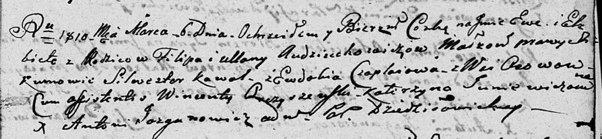

**Авдюхович Ева Филипова (Audziuchowiczowna Ewa Elżbieta)**

6 марта 1810 г -- крещение (НИАБ 136-13-894, лист 77, №11/1810-р
(ориг)).

**НИАБ 136-13-894:** Лист 77. **Метрическая запись №11/1810-р (ориг).**

{width="6.496527777777778in"
height="1.5026027996500437in"}

Дедиловичская Покровская церковь. 6 марта 1810 года. Метрическая запись
о крещении.

Audziuchowiczowna Ewa Elżbieta -- дочь родителей с деревни Осовo.

Audziuchowicz Filip -- отец.

Audziuchowiczowa Ullana -- мать.

Kawal Silswester -- кум.

Czaplaiowa Ewdokija -- кума.

Arcziszewski Wincenty -- ассистент.

Juniewiczowna Katerzyna -- ассистентка.

Jazgunowicz Antoni -- ксёндз.
