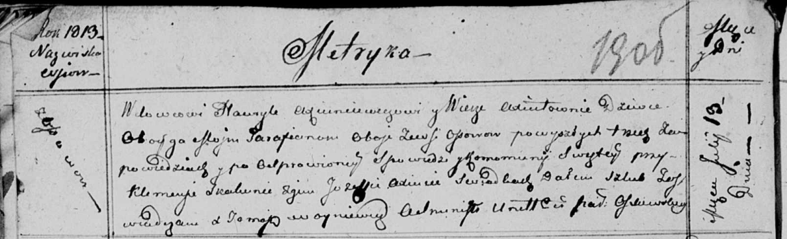

**Аксюта Павел (Axiuta Paweł)**

3 августа 1815 г -- отпевание, умер в возрасте 46 лет (родился около
1769 г) (НИАБ 136-13-919, лист 29об, №21/1815-у (ориг)).

**НИАБ 136-13-919:** Лист 29об. **Метрическая запись №21/1815-у
(ориг).**

{width="6.496527777777778in"
height="0.8451388888888889in"}

Осовская униатская церковь. 3 августа 1815 года. Метрическая запись об
отпевании.

Axiuta Paweł -- умер внезапно, 46 лет, с деревни Осово, похоронен на
кладбище деревни Осово.

Woyniewicz Tomasz -- ксёндз.
