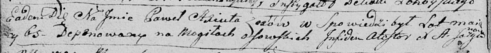

**Аксюта Павел (Axiuta Paweł)**

18 сентября 1794 г -- отпевание, умер в возрасте 65 лет (родился около
1729 г) (НИАБ 136-13-919, лист 2об, №34/1794-у (ориг)).

**НИАБ 136-13-919:** Лист 2об. **Метрическая запись №34/1794-у (ориг).**

Дедиловичская Покровская церковь. 18 сентября 1794 года. Метрическая
запись об отпевании.

Axiuta Paweł -- умерший, 65 лет, с деревни Осово, похоронен на кладбище
деревни Осово.

Jazgunowicz Antoni -- ксёндз.
