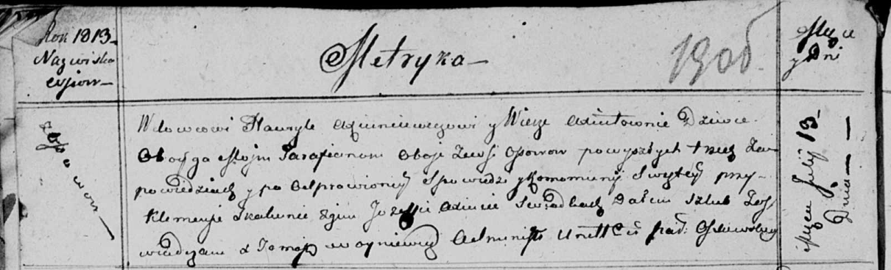

**Аксюта Ульяна (Axiutowa Ullana)**

27 марта 1815 г -- отпевание, умерла в возрасте 70 лет (родилась около
1745 г) (НИАБ 136-13-919, лист 29, №11/1815-у (ориг)).

**НИАБ 136-13-919:** Лист 29. **Метрическая запись №11/1815-у (ориг).**

{width="6.496527777777778in"
height="1.070138888888889in"}

Осовская униатская церковь. 27 марта 1815 года. Метрическая запись об
отпевании.

Axiutowa Ullana -- умершая, 70 лет, с деревни Осово, похоронена на
кладбище деревни Осово.

Woyniewicz Tomasz -- ксёндз.
