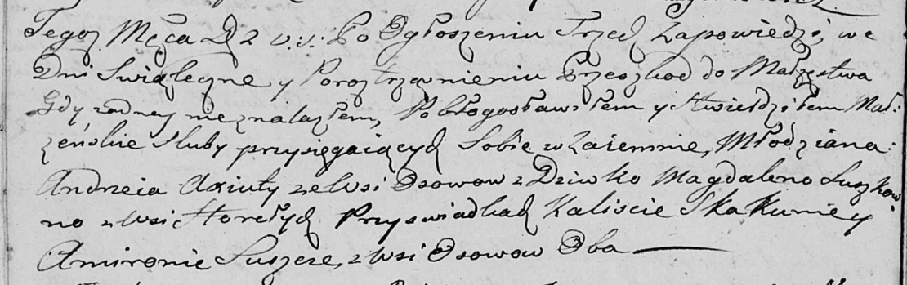
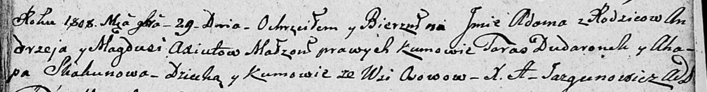

**Аксюта Магдуся, Магдалена (Axiutowa Magdusia, Magdalena)**

2 ноября 1802 г -- венчание с молодым Андреем Аксютой с деревни Осово
(НИАБ 136-13-920, лист 8об, №6/1802-б (ориг)).

29 ноября 1808 г -- крещение сына Адама (НИАБ 136-13-894, лист 73,
№45/1808-р (ориг)).

**НИАБ 136-13-920:** Лист 8об. **Метрическая запись №6/1802-б (ориг).**

Дедиловичская Покровская церковь. 2 ноября 1802 года. Метрическая запись
о венчании.

Axiuta Andrzey -- жених, молодой, с деревни Осовo.

Suszkowna Magdalena -- невеста, девка, с деревни Горелое.

Skakun Kalist -- свидетель, с деревни Осовo.

Suszko Amiron -- свидетель, с деревни Осовo.

Jazgunowicz Antoni -- ксёндз.

**НИАБ 136-13-894:** Лист 73. **Метрическая запись №45/1808-р (ориг).**

Дедиловичская Покровская церковь. 29 ноября 1808 года. Метрическая
запись о крещении.

Axiuta Adam -- сын родителей с деревни Осово.

Axiuta Andrzey -- отец.

Axiutowa Magdusia -- мать.

Dudaronek Taras -- кум, с деревни Осово.

Skakunowa Ahapa -- кума, с деревни Осово.

Jazgunowicz Antoni -- ксёндз.
