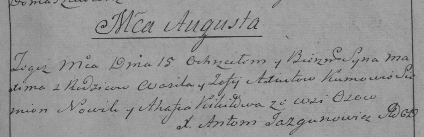

**Аксюта Василь (Axiuta Wasil)**

15 августа 1786 г -- крещение сына Максима (РГИА 823-2-18, лист 232,
№20/1786-р (коп)).

**РГИА 823-2-18:** Лист 232. **Метрическая запись №20/1786-р (коп).**

Дедиловичская Покровская церковь. 15 августа 1786 года. Метрическая
запись о крещении.

Axiuto Maxim -- сын родителей с деревни Осово.

Axiuto Wasil -- отец.

Axiutowa Zofija -- мать.

Nowik Siemion -- кум.

Kikiłowa Ahafija - кума.

Jazgunowicz Antoni -- ксёндз.
