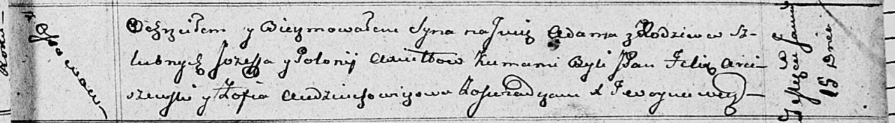

**Аксюта Адам Иосифов (Axiuta Adam)**

15 января 1812 г -- крещение (НИАБ 136-13-894, лист 83, №4/1812-р
(ориг)).

**НИАБ 136-13-894:** Лист 83. **Метрическая запись №4/1812-р (ориг).**

Осовская Покровская церковь. 15 января 1812 года. Метрическая запись о
крещении.

Axiuta Adam -- сын родителей с деревни Осовo.

Axiuta Jozef -- отец.

Axiutowa Połonija -- мать.

Arciszewski Felix, JP -- кум, шляхтич.

Audziuchowiczowa Zofia -- кума.

Woyniewicz Tomasz -- ксёндз.
