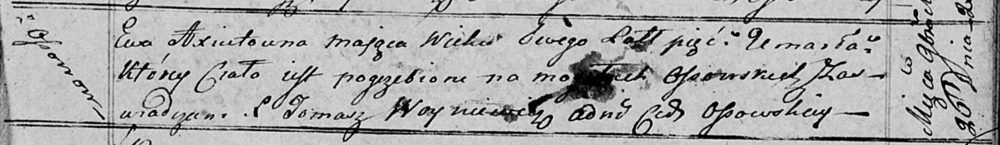

**Аксюта Ева Павлова (Axiutowna Ewa)**

30 марта 1813 г -- крещение (НИАБ 136-13-894, лист 86, №7/1813-р
(ориг)).

26 ноября 1817 г -- отпевание, умерла в возрасте 5 лет (НИАБ 136-13-919,
лист 31, №20/1817-у (ориг)).

**НИАБ 136-13-894:** Лист 86. **Метрическая запись №7/1813-р (ориг).**

Осовская Покровская церковь. 30 марта 1813 года. Метрическая запись о
крещении.

Axiutowna Ewa -- дочь родителей с деревни Осовo.

Axiuta Paweł -- отец.

Axiutowa Ahafia -- мать.

Szyło Łukasz -- кум.

Rozynkowa Parasia -- кума.

Woyniewicz Tomasz -- ксёндз.

**НИАБ 136-13-919:** Лист 31. **Метрическая запись №20/1817-у (ориг).**

Осовская униатская церковь. 26 ноября 1817 года. Метрическая запись об
отпевании.

Axiutowa Ewa -- умершая, 5 лет, с деревни Осово, похоронена на кладбище
деревни Осово.

Woyniewicz Tomasz -- ксёндз.
