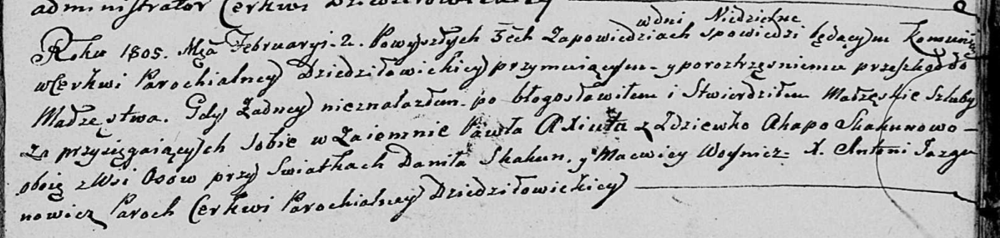
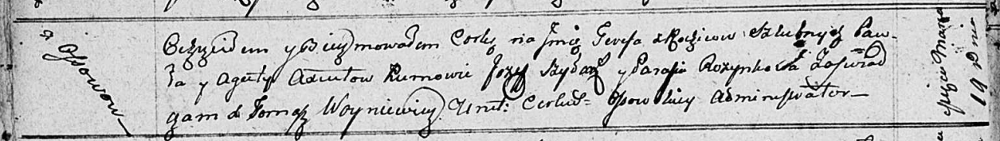
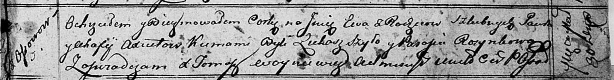

**Аксюта Павел (Axiuta Paweł)**

2 февраля 1805 г -- венчание с девкой Агатой Скакун с деревни Осово
(НИАБ 136-13-920, лист 11, №1/1805-б (ориг)).

19 марта 1811 г -- крещение дочери Тересы (НИАБ 136-13-894, лист 80об,
№14/1811-р (ориг)).

30 марта 1813 г -- крещение дочери Евы (НИАБ 136-13-894, лист 86,
№7/1813-р (ориг)).

**НИАБ 136-13-920:** Лист 11. **Метрическая запись №1/1805-б (ориг).**

Дедиловичская Покровская церковь. 2 февраля 1805 года. Метрическая
запись о венчании.

Axiuta Paweł -- жених, с деревни Осовo.

Skakunowa Agata -- невеста, девка, с деревни Осовo.

Skakun Daniła -- свидетель.

Woynicz Macwiey -- свидетель.

Jazgunowicz Antoni -- ксёндз.

**НИАБ 136-13-894:** Лист 80об. **Метрическая запись №14/1811-р
(ориг).**

Осовская Покровская церковь. 19 марта 1811 года. Метрическая запись о
крещении.

Axiutowna Teresa -- дочь родителей с деревни Осовo.

Axuita Paweł -- отец.

Axiutowa Agata -- мать.

Szyłak Jozef -- кум.

Rozynkowa Parasia -- кума.

Woyniewicz Tomasz -- ксёндз.

**НИАБ 136-13-894:** Лист 86. **Метрическая запись №7/1813-р (ориг).**

Осовская Покровская церковь. 30 марта 1813 года. Метрическая запись о
крещении.

Axiutowna Ewa -- дочь родителей с деревни Осовo.

Axiuta Paweł -- отец.

Axiutowa Ahafia -- мать.

Szyło Łukasz -- кум.

Rozynkowa Parasia -- кума.

Woyniewicz Tomasz -- ксёндз.
