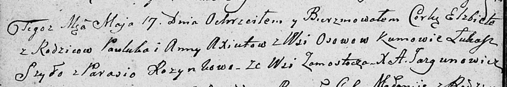

**Аксюта Елисавета Павлюкова (Axiutowna Elżbieta)**

17 мая 1809 г -- крещение (НИАБ 136-13-894, лист 74об, №24/1809-р
(ориг)).

**НИАБ 136-13-894:** Лист 74об. **Метрическая запись №24/1809-р
(ориг).**

Дедиловичская Покровская церковь. 17 мая 1809 года. Метрическая запись о
крещении.

Axiutowna Elżbieta -- дочь родителей с деревни Осовo.

Axiuta Pauluk -- отец.

Axiutowa Anna -- мать.

Szyło Łukasz -- кум.

Rozynkowa Parasia -- кума, с деревни Замосточье.

Jazgunowicz Antoni -- ксёндз.
