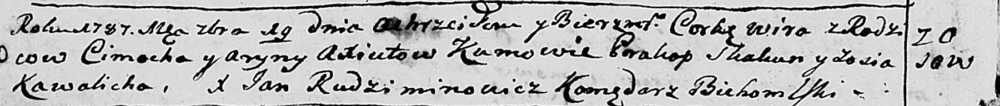

**Аксюта Арына (Axiutowa Aryna)**

19 сентября 1787 г -- крещение дочери Виры (НИАБ 136-13-894, лист 2об,
№46/1787-р (ориг)).

**НИАБ 136-13-894:** Лист 2об. **Метрическая запись №46/1787-р (ориг).**

Дедиловичская Покровская церковь. 19 сентября 1787 года. Метрическая
запись о крещении.

Axiutowna Wira - дочь родителей с деревни Осово.

Axiuta Cimoch -- отец.

Axiutowa Aryna -- мать.

Skakun Prakop - кум.

Kawalicha Zosia - кума.

Rudziminowicz Jan -- ксёндз, комендант Бегомльской церкви.
