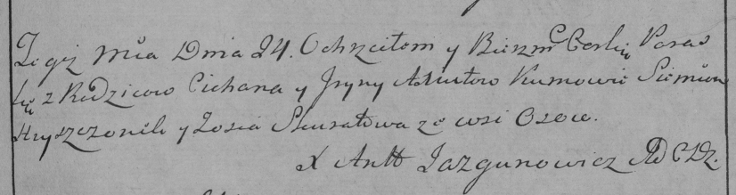
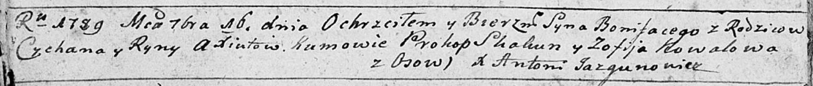

**Аксюта Параска Циханова (Axiutowna Paraska)**

24 сентября 1785 г -- крещение (РГИА 823-2-18, лист 230, №25/1785-р
(коп)).

**РГИА 823-2-18:** Лист 230. **Метрическая запись №25/1785-р (коп).**

Дедиловичская Покровская церковь. 24 сентября 1785 года. Метрическая
запись о крещении.

Axiutowna Paraska -- дочь родителей с деревни Осово.

Axiuta Cichan -- отец.

Axiutowa Jryna -- мать.

Hryszczonek Siemion -- кум.

Skuratowa? Zosia - кума.

Jazgunowicz Antoni -- ксёндз.

**НИАБ 136-13-894:** Лист 7об. **Метрическая запись №47/1789-р (ориг).**

Дедиловичская Покровская церковь. 16 сентября 1789 года. Метрическая
запись о крещении.

Axiuta Bonifacy -- сын родителей с деревни Осово.

Axiuta Cychan -- отец.

Axiutowa Ryna -- мать.

Skakun Prokop - кум.

Kowalowa Zofija - кума.

Jazgunowicz Antoni -- ксёндз.
