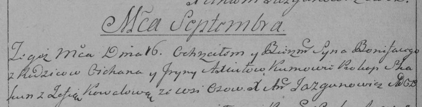

**Аксюта Бонифацы Циханов (Axiuta Bonifacy)**

16 сентября 1789 г -- крещение (НИАБ 136-13-894, лист 7об, №47/1789-р
(ориг)), (РГИА 823-2-18, лист 238об, №20/1789-р (коп)).

**НИАБ 136-13-894:** Лист 7об. **Метрическая запись №47/1789-р (ориг).**

{width="6.496527777777778in"
height="0.6946434820647419in"}

Дедиловичская Покровская церковь. 16 сентября 1789 года. Метрическая
запись о крещении.

Axiuta Bonifacy -- сын родителей с деревни Осово.

Axiuta Cychan -- отец.

Axiutowa Ryna -- мать.

Skakun Prokop - кум.

Kowalowa Zofija - кума.

Jazgunowicz Antoni -- ксёндз.

**РГИА 823-2-18:** Лист 238об. **Метрическая запись №20/1789-р (коп).**

{width="6.496527777777778in"
height="1.6569444444444446in"}

Дедиловичская Покровская церковь. 16 сентября 1789 года. Метрическая
запись о крещении.

Axiuto Bonifacy -- сын родителей с деревни Осово.

Axiuto Cichan -- отец.

Axiutowa Jryna -- мать.

Skakun Prokop -- кум.

Kowalowa Zofia - кума.

Jazgunowicz Antoni -- ксёндз.
