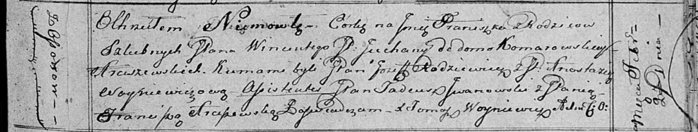

**Арцишевский Францишка? Винцентова, шляхтянка (Arciszewska
Franciszka?)**

20 февраля 1816 г -- крещение (НИАБ 136-13-894, лист 93, №3/1816-р
(ориг)).

**НИАБ 136-13-894:** Лист 93. **Метрическая запись №3/1816-р (ориг).**

Осовская Покровская церковь. 20 февраля 1816 года. Метрическая запись о
крещении.

Arciszewska Franciszka?, JP -- дочь родителей с деревни Осово,
шляхтянка.

Arciszewski Wincenty, JP -- отец.

Arciszewska z Komarowskich Juchana, JP -- мать, шляхтянка.

Rodziewicz Jozef, JP -- кум, шляхтич.

Woyniewiczowa Anastazija, JP -- кума, шляхтянка.

Jwanowski Tadeusz, JP -- ассистент, шляхтич.

Arciszewska Franciszka, JP -- ассистентка. шляхтянка.

Woyniewicz Tomasz -- ксёндз.
