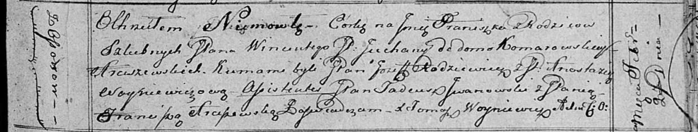

**Арцишевский Винценты, шляхтич (Arciszewski Wincenty, Vikenti)**

25 октября 1803 г -- крещение сына Ксаверия (НИАБ 937-4-32, лист 9об,
№26/1803-р).

26 октября 1805 г -- крещение дочери Богумилы (НИАБ 937-4-32, лист 12об,
№39/1805-р).

20 февраля 1816 г -- крещение дочери Францишки? (НИАБ 136-13-894, лист
93, №3/1816-р (ориг)).

**НИАБ 937-4-32:** Лист 9об. **Метрическая запись №26/1803-р.**

Дедиловичский костел Наисвятейшего Сердца Иисуса. 25 октября 1803 года.
Метрическая запись о крещении.

Arciszewski Xawery -- сын шляхтичей с деревни Осово.

Arciszewski Wincenty -- отец.

Arciszewska Joanna -- мать.

Odyniec Romuald -- крестный отец, шляхтич, писарь Дедиловичский.

Czarnocka Justyna -- крестная мать, шляхтянка, ротмистрова Смоленского.

Buiewicz Michał - ассистент, шляхтич, эконом Замосточский.

Chodasewiczowa Magdalena - ассистентка, шляхтянка.

Czarnocki Jozef - ассистент, шляхтич.

Michalska Rozalia - ассистентка, шляхтянка.

Galinowski Joann -- ксёндз, комендант Дедиловичского костела.

**НИАБ 937-4-32:** Лист 12об. **Метрическая запись №39/1805-р.**

Дедиловичский костел Наисвятейшего Сердца Иисуса. 26 октября 1805 года.
Метрическая запись о крещении.

Arciszewska Bogumiła -- дочь вольных людей с деревни Осово.

Arciszewski Vikenti -- отец.

Arciszewska Johana -- мать.

Bujewicz Michael -- крестный отец, шляхтич, эконом деревни Замосточье.

Michalska Rosalia -- крестная мать, шляхтянка, с деревни Клинники.

Linhart Hiacinthus -- ксёндз.

**НИАБ 136-13-894:** Лист 93. **Метрическая запись №3/1816-р (ориг).**

Осовская Покровская церковь. 20 февраля 1816 года. Метрическая запись о
крещении.

Arciszewska Franciszka?, JP -- дочь родителей с деревни Осово,
шляхтянка.

Arciszewski Wincenty, JP -- отец.

Arciszewska z Komarowskich Juchana, JP -- мать, шляхтянка.

Rodziewicz Jozef, JP -- кум, шляхтич.

Woyniewiczowa Anastazija, JP -- кума, шляхтянка.

Jwanowski Tadeusz, JP -- ассистент, шляхтич.

Arciszewska Franciszka, JP -- ассистентка. шляхтянка.

Woyniewicz Tomasz -- ксёндз.
