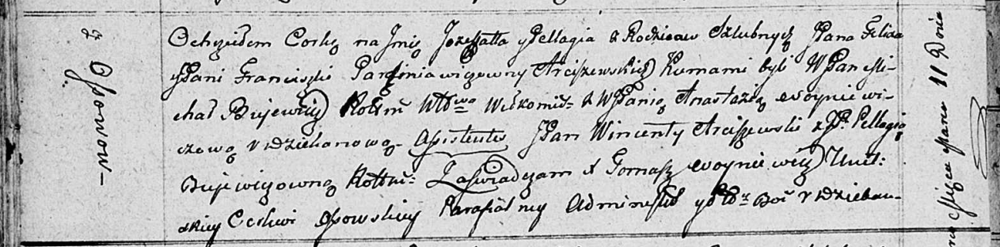

**Арцишевская Ёзефата Феликсова (Arciszewska Jozefata Pellagia)**

11 марта 1811 г -- крещение (НИАБ 136-13-894, лист 80об, №12/1811-р
(ориг)).

**НИАБ 136-13-894:** Лист 80об. **Метрическая запись №12/1811-р
(ориг).**

{width="6.496527777777778in"
height="1.6045199037620297in"}

Осовская Покровская церковь. 11 марта 1811 года. Метрическая запись о
крещении.

Arciszewska Jozefata Pellagia, JP -- дочь родителей с деревни Осовo,
шляхтянка.

Arciszewski Felix, JP -- отец, шляхтич.

Arciszewska Franciszka z Parcziniawiczow, JP -- мать, шляхтянка.

Bujewicz Michal, WJP -- кум, шляхтич, ротмистр?.

Woyniewiczowa Anastazia, WJP -- кума, шляхтянка, дьяконова.

Arziszewski Wincenty, JP -- кум, шляхтич.

Bujewiczowna Pellagia, JP -- кума шляхтянка.

Woyniewicz Tomasz -- ксёндз.
