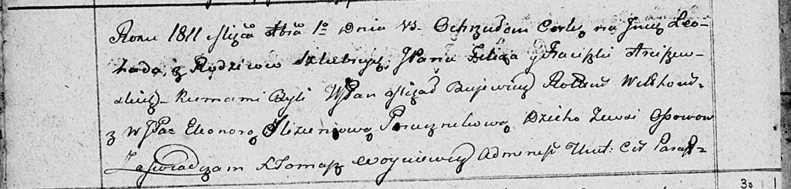

**Арцишевский Феликс (Arciszewski Felix)**

28 июня 1808 г -- крещение дочери Юстины (НИАБ 937-4-32, лист 18об,
№19/1808-р).

11 марта 1811 г -- крещение дочери Ёзефаты Пелагии (НИАБ 136-13-894,
лист 80об, №12/1811-р (ориг)).

1 декабря 1811 г -- крещение дочери Леокады (НИАБ 136-13-894, лист 82об,
№59/1811-р (ориг)).

**НИАБ 937-4-32:** Лист 18об. **Метрическая запись №19/1808-р.**

{width="6.496527777777778in"
height="1.1125in"}

Дедиловичский костел Наисвятейшего Сердца Иисуса. 28 июня 1808 года.
Метрическая запись о крещении.

Arciszewska Justina -- дочь шляхтичей с деревни Осово.

Arciszewski Felix -- отец.

Arciszewska Francisca z Parafianowiczow -- мать.

Buiewicz Michael -- крестный отец, шляхтич.

Czarnocka Justina -- крестная мать, шляхтянка, девица.

Zychowski Gabriel -- ксёндз.

**НИАБ 136-13-894:** Лист 80об. **Метрическая запись №12/1811-р
(ориг).**

{width="6.496527777777778in"
height="1.6045199037620297in"}

Осовская Покровская церковь. 11 марта 1811 года. Метрическая запись о
крещении.

Arciszewska Jozefata Pellagia, JP -- дочь родителей с деревни Осовo,
шляхтянка.

Arciszewski Felix, JP -- отец, шляхтич.

Arciszewska Franciszka z Parcziniawiczow, JP -- мать, шляхтянка.

Bujewicz Michal, WJP -- кум, шляхтич, ротмистр?.

Woyniewiczowa Anastazia, WJP -- кума, шляхтянка, дьяконова.

Arziszewski Wincenty, JP -- кум, шляхтич.

Bujewiczowna Pellagia, JP -- кума шляхтянка.

Woyniewicz Tomasz -- ксёндз.

**НИАБ 136-13-894:** 82об. **Метрическая запись №59/1811-р (ориг).**

{width="6.496527777777778in"
height="1.557584208223972in"}

Осовская Покровская церковь. 1 декабря 1811 года. Метрическая запись о
крещении.

Arciszewska Leokada, JP -- дочь законных супругов, шляхтянка, с деревни
Осовo.

Arciszewski Felix, JP -- отец, шляхтич.

Arciszewska Frąciszka, JP -- мать, шляхтянка.

Bujewicz Michał, WJP -- кум, шляхтич, ротмистр?.

Slizieniowa Eleonora, WJP -- кума, шляхтянка, поручникова.

Woyniewicz Tomasz -- ксёндз.
