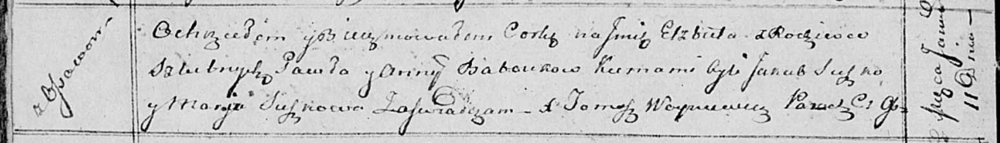

**Бабовка Елисавета Павлова (Baboukowna Elżbieta)**

11 января 1814 г -- крещение (НИАБ 136-13-894, лист 88об, №2/1814-р
(ориг)).

**НИАБ 136-13-894:** Лист 88об. **Метрическая запись №2/1814-р (ориг).**

Осовская Покровская церковь. 11 января 1814 года. Метрическая запись о
крещении.

Baboukowna Elżbieta -- дочь родителей с деревни Осовo.

Babouka Paweł -- отец.

Baboukowna Anna -- мать.

Suszko Jakub -- кум.

Suszkowa Marija -- кума.

Woyniewicz Tomasz -- ксёндз.
