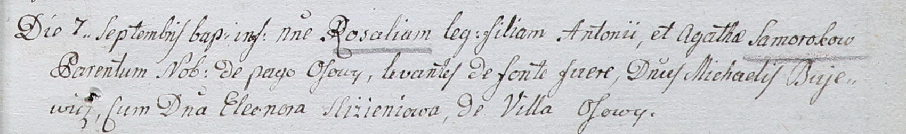

**Буевич Михал (Bujewicz Michael)**

7 сентября 1802 г -- крестный отец Розалии, сына шляхтичей Антона и
Агаты Сумароков с деревни Осово (НИАБ 937-4-32, лист 7, №27/1802-р).

**НИАБ 937-4-32:** Лист 7. **Метрическая запись №27/1802-р.**

{width="6.496527777777778in"
height="0.9666666666666667in"}

Дедиловичский костел Наисвятейшего Сердца Иисуса. 7 сентября 1802 года.
Метрическая запись о крещении.

Somorokowa Rosalia -- дочь шляхтичей с деревни Осово.

Somoroka Antoni -- отец.

Somorokowa Agatha -- мать.

Bujewicz Michael -- крестный отец, шляхтич, с деревни Осово.

Slizieniowa Eleonora -- крестная мать, шляхтянка.

Linhart Hyacinthus -- ксёндз.
