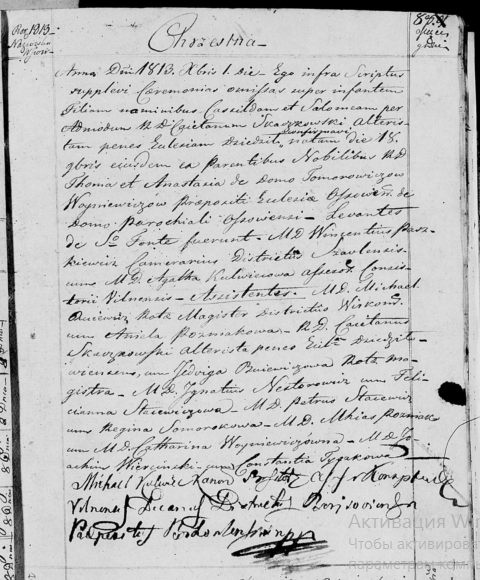

**Войневич ? Томашова, шляхтянка (Woyniewiczowna ? Sałomea)**

1 декабря 1813 г -- крещение (НИАБ 136-13-894, лист 88, №41/1813-р
(ориг)).

Лист 88. **Метрическая запись №41/1813-р (ориг).**

{width="5.0in"
height="6.041666666666667in"}

Осовская Покровская церковь. 1 декабря 1813 года. Метрическая запись о
крещении.

Woyniewiczowna \... Sałomea, JP -- дочь родителей с деревни, шляхтянка.

Woyniewicz Thoma, JP -- отец, шляхтич.

Woyniewiczowa z Tomarewiczow Anastazia, JP -- мать, шляхтянка.

Paszkiewicz Wincentius, JP -- кум, шляхтич.

Kulwecowa Agatha, JP -- кума, шляхтянка.

Buiewicz Michael, JP -- ассистент, шляхтич.

Pozniakowa Aniela, JP -- ассистентка, шляхтянка.

Skarzkowski? Caietanus, JP -- ассистент, шляхтич.

Buiewiczowa Jedwiga, JP -- ассистентка, шляхтянка.

Nestorowicz? Jgnatius, JP -- ассистент, шляхтич.

Stacewiczowa Felicianna, JP -- ассистентка, шляхтянка.

Stacewicz Petrus, JP -- ассистент, шляхтич.

Somorokowa Regina -- ассистентка.

Pozniak Mihaś, JP -- асссистент, шляхтич.

Woyniewiczowna Catarina, JP -- ассистентка, шляхтянка.

Wercinski Joachim, JP -- ассистент, шляхтич.

Tyczkowa Constantia -- кума, ассистентка.

Woyniewicz Tomasz -- ксёндз. (лат. язык)
