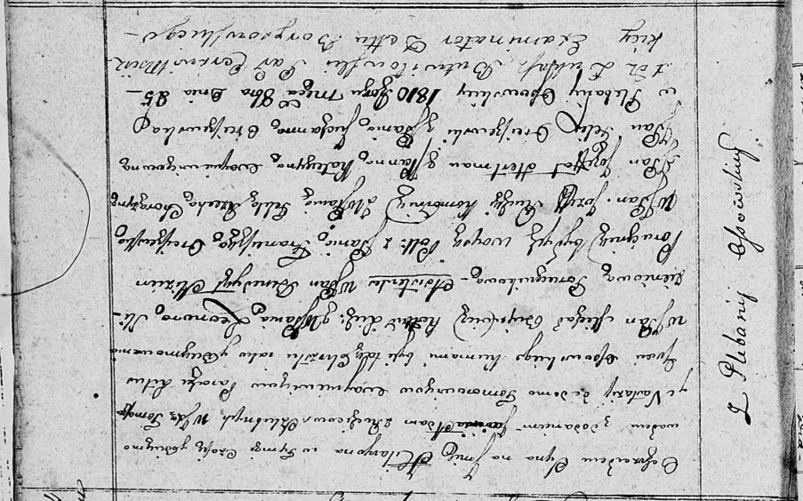

**Войневич Гилярыон Томашов, шляхтич (Woyniewicz Hilaryon Adam)**

8 октября 1810 г -- крещение (НИАБ 136-13-894, лист 79, №50/1810-р
(ориг)).

**НИАБ 136-13-894:** Лист 79. **Метрическая запись №50/1810-р (ориг).**

{width="6.496527777777778in"
height="4.0578991688538935in"}

Осовская Покровская церковь. 8 октября 1810 года. Метрическая запись о
крещении.

Woyniewicz Hilaryon Adam, WJP -- сын законных супругов, шляхтич, с
плебании Осовo.

Woyniewicz Tomasz, WJP -- отец, шляхтич, плебания Осовo.

Woyniewiczowa Nastasia s Tomorowiczow, WJP -- мать, шляхтянка, с
плебании Осовo.

Bujewicz Michaś, WJP -- кум, шляхтич.

Slizniowa Leonora, WJP -- кума, шляхтянка, поручникова.

Slizień Benedykt, WJP -- ассистент, шляхтич, поручик бывшего войска
Польского.

Orciszewska Franciszka, JP -- ассистентка, шляхтянка.

Rucki Jozef, WJP -- ассистент, шляхтич, коморник.

Rzecha? Tekla, WJP -- ассистентка, шляхтянка, хорунжего.

Hertman Jozef, JP -- ассистент, шляхтич.

Woyniewiczowna Katerzyna, JP -- ассистентка, шляхтянка.

Orciszewski Felix, JP -- ассистент, шляхтич.

Orciszewska Juchanna, JP -- ассистентка, шляхтянка.

Butwilowski Lukasz -- ксёндз, администратор Мстижской церкви.
