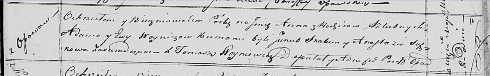

**Войнич Ева (Woyniczowa Ewa)**

2 мая 1820 г -- крещение дочери Анны (НИАБ 136-13-894, лист 104,
№14/1820-р (ориг)).

**НИАБ 136-13-894:** Лист 104. **Метрическая запись №14/1820-р (ориг).**

Осовская Покровская церковь. 2 мая 1820 года. Метрическая запись о
крещении.

Woyniczowna Anna -- дочь родителей с деревни Осовo.

Woynicz Adam -- отец.

Woyniczowa Ewa -- мать.

Skakun Jakub -- кум.

Suszkowa Anastazija -- кума.

Woyniewicz Tomasz -- ксёндз.
