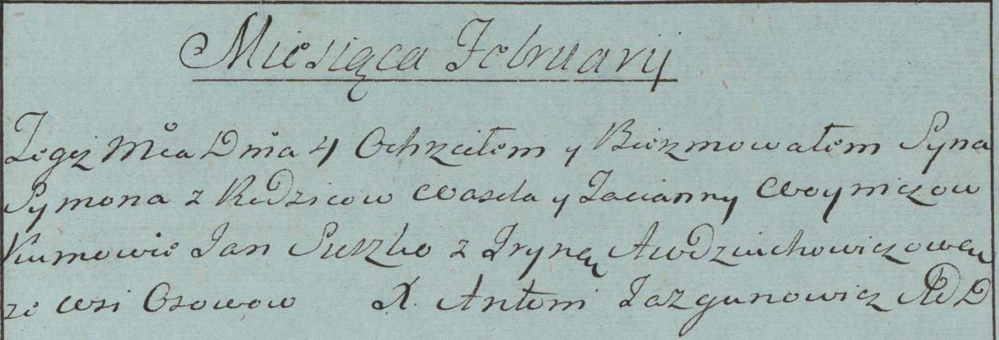
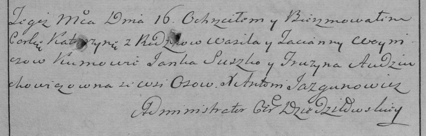

**Войнич Василь (Woynicz Wasil)**

4 февраля 1784 г -- крещение сына Сымона (РГИА 823-2-18, лист 226,
№4/1784-р (коп)).

16 ноября 1785 г -- крещение дочери Катерыны (РГИА 823-2-18, лист 230,
№28/1785-р (коп)).

29 октября 1790 г -- крещение сына Яна (НИАБ 136-13-894, лист 11,
№66/1790-р (коп)), (РГИА 823-2-18, лист 240об, №27/1790-р (коп)).

18 октября 1793 г -- крещение сына Янки (НИАБ 136-13-894, лист 20об,
№73/1793-р (коп)), (РГИА 823-2-18, лист 248об, №39/1793-р (коп)).

18 января 1797 г -- крещение сына Адама (НИАБ 136-13-894, лист 32,
№4/1797-р (коп)), (РГИА 823-2-18, лист 258об, №4/1797-р (коп)).

20 ноября 1799 г -- крестный отец Сымона, сына Скакунов Хведора и Анны с
деревни Осово (НИАБ 136-13-894, лист 40, №48/1799-р (коп)).

8 февраля 1803 г -- свидетель венчания молодого Стефана Дударёнка с
деревни Осово на вдове Евгении Сушко с деревни Клинники (НИАБ
136-13-920, лист 9, №3/1803-б (ориг)).

24 января 1804 г -- крестный отец Клеменса? Антона, сына Скакунов
Хведора и Анны с деревни Осово (НИАБ 136-13-894, лист 53, №3/1803-р
(коп)).

**РГИА 823-2-18:** Лист 226. **Метрическая запись №4/1784-р (коп).**

Дедиловичская Покровская церковь. 4 февраля 1784 года. Метрическая
запись о крещении.

Woynicz Symon -- сын родителей с деревни Осово.

Woynicz Wasil -- отец.

Woyniczowa Tacianna -- мать.

Suszko Jan -- кум.

Audziuchowiczowa Jryna - кума.

Jazgunowicz Antoni -- ксёндз.

**РГИА 823-2-18:** Лист 230. **Метрическая запись №28/1785-р (коп).**

Дедиловичская Покровская церковь. 16 ноября 1785 года. Метрическая
запись о крещении.

Woyniczowna Katerzyna -- дочь родителей с деревни Осово.

Woynicz Wasil -- отец.

Woyniczowa Tacianna -- мать.

Suszko Janka -- кум.

Audziuchowiczowna Fruzyna - кума.

Jazgunowicz Antoni -- ксёндз.

**НИАБ 136-13-894:** Лист 11. **Метрическая запись №66/1790-р (ориг).**

Дедиловичская Покровская церковь. 29 октября 1790 года. Метрическая
запись о крещении.

Woynicz Jan -- сын родителей с деревни Осово.

Woynicz Wasil -- отец.

Woyniczowa Taciana -- мать.

Suszko Jan - кум.

Skakunicha Aryna - кума.

Jazgunowicz Antoni -- ксёндз.

**РГИА 823-2-18:** Лист 240об. **Метрическая запись №27/1790-р (коп).**

Дедиловичская Покровская церковь. 29 октября 1790 года. Метрическая
запись о крещении.

Woynicz Jan -- сын родителей с деревни Осово.

Woynicz Wasil -- отец.

Woyniczowa Tacianna -- мать.

Suszko Jan -- кум.

Skakunowa Aryna - кума.

Jazgunowicz Antoni -- ксёндз.

**НИАБ 136-13-894:** Лист 20-об. **Метрическая запись №73/1793-р
(ориг).**

Дедиловичская Покровская церковь. 18 октября 1793 года. Метрическая
запись о крещении.

Woynicz Janka -- сын родителей с деревни Осовo.

Woynicz Wasil -- отец.

Woyniczowa Taсiana-- мать.

Suszko Jan - кум.

Skakunowa Ryna - кума.

Jazgunowicz Antoni -- ксёндз.

**РГИА 823-2-18:** Лист 248об. **Метрическая запись №40/1793-р (коп).**

Дедиловичская Покровская церковь. \[18\] октября 1793 года. Метрическая
запись о крещении.

Woynicz Janka -- сын родителей с деревни Осово.

Woynicz Wasil -- отец.

Woyniczowa Tacianna -- мать.

Suszko Jan -- кум.

Skakunowa Aryna -- кума.

Jazgunowicz Antoni -- ксёндз.

**НИАБ 136-13-894:** Лист 32. **Метрическая запись №4/1797-р (ориг).**

Дедиловичская Покровская церковь. 18 января 1797 года. Метрическая
запись о крещении.

Woynicz Adam -- сын родителей с деревни Осовo.

Woynicz Wasil -- отец.

Woyniczowa Taciana -- мать.

Suszko Janka - кум.

Skakunicha Ryna - кума.

Jazgunowicz Antoni -- ксёндз.

**РГИА 823-2-18:** Лист 258об. **Метрическая запись №4/1797-р (коп).**

Дедиловичская Покровская церковь. 18 января 1797 года. Метрическая
запись о крещении.

Woynicz Adam -- сын родителей с деревни Осово.

Woynicz Wasil -- отец.

Woyniczowa Tacianna -- мать.

Suszko Janko -- кум.

Skakunowa Jryna -- кума.

Jazgunowicz Antoni -- ксёндз.

**НИАБ 136-13-894:** Лист 40. **Метрическая запись №48/1799-р (ориг).**

Дедиловичская Покровская церковь. 20 ноября 1799 года. Метрическая
запись о крещении.

Skakun Symon -- сын родителей с деревни Осовo.

Skakun Chwiedor -- отец.

Skakunowa Anna -- мать.

Woynicz Wasil -- кум, с деревни Осовo.

Skakunowa Anna -- кума, с деревни Осовo.

Jazgunowicz Antoni -- ксёндз.

**НИАБ 136-13-920:** Лист 9. **Метрическая запись №3/1803-б (ориг).**

Дедиловичская Покровская церковь. 8 февраля 1803 года. Метрическая
запись о венчании.

Dudaronek Stefan -- жених, молодой, с деревни Осовo.

Suszkowa Euhenia -- невеста, вдова, с деревни Клинники.

Woynicz Wasil -- свидетель, с деревни Осовo.

Bartnowski Piotr -- свидетель.

Jazgunowicz Antoni -- ксёндз.

**НИАБ 136-13-894:** Лист 53. **Метрическая запись №3/1804-р (ориг).**

Дедиловичская Покровская церковь. 24 января 1804 года. Метрическая
запись о крещении.

Skakun Klemens? Antoni -- сын родителей с деревни Осовo.

Skakun Chwiedor -- отец.

Skakunowa Anna -- мать.

Woynicz Wasil -- кум, с деревни Осовo.

Kikiłowa Ullana -- кума.

Jazgunowicz Antoni -- ксёндз.
