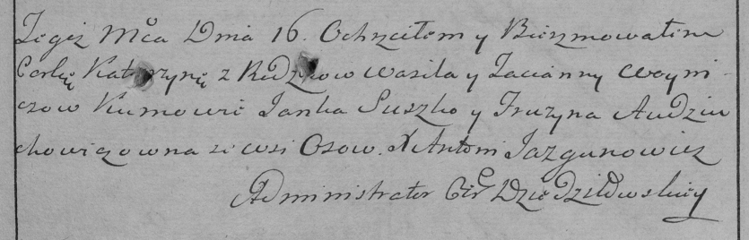

**Войнич Катерына Василева (Woyniczowna Katerzyna)**

16 ноября 1785 г -- крещение дочери Катерыны (РГИА 823-2-18, лист 230,
№28/1785-р (коп)).

**РГИА 823-2-18:** Лист 230. **Метрическая запись №28/1785-р (коп).**

{width="6.496527777777778in"
height="2.0854166666666667in"}

Дедиловичская Покровская церковь. 16 ноября 1785 года. Метрическая
запись о крещении.

Woyniczowna Katerzyna -- дочь родителей с деревни Осово.

Woynicz Wasil -- отец.

Woyniczowa Tacianna -- мать.

Suszko Janka -- кум.

Audziuchowiczowna Fruzyna - кума.

Jazgunowicz Antoni -- ксёндз.
