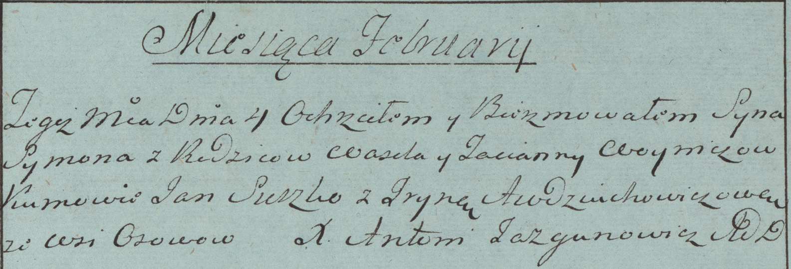

**Войнич Сымон Василев (Woynicz Symon)**

4 февраля 1784 г -- крещение (РГИА 823-2-18, лист 226, №4/1784-р (коп)).

**РГИА 823-2-18:** Лист 226. **Метрическая запись №4/1784-р (коп).**

Дедиловичская Покровская церковь. 4 февраля 1784 года. Метрическая
запись о крещении.

Woynicz Symon -- сын родителей с деревни Осово.

Woynicz Wasil -- отец.

Woyniczowa Tacianna -- мать.

Suszko Jan -- кум.

Audziuchowiczowa Jryna - кума.

Jazgunowicz Antoni -- ксёндз.
