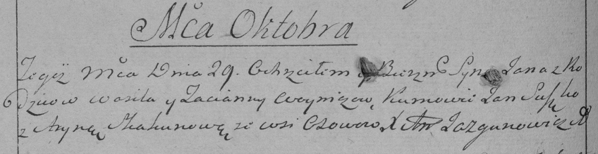

**Войнич Ян Василев (Woynicz Jan)**

29 октября 1790 г -- крещение (НИАБ 136-13-894, лист 11, №66/1790-р
(коп)), (РГИА 823-2-18, лист 240об, №27/1790-р (коп)).

**НИАБ 136-13-894:** Лист 11. **Метрическая запись №66/1790-р (ориг).**

Дедиловичская Покровская церковь. 29 октября 1790 года. Метрическая
запись о крещении.

Woynicz Jan -- сын родителей с деревни Осово.

Woynicz Wasil -- отец.

Woyniczowa Taciana -- мать.

Suszko Jan - кум.

Skakunicha Aryna - кума.

Jazgunowicz Antoni -- ксёндз.

**РГИА 823-2-18:** Лист 240об. **Метрическая запись №27/1790-р (коп).**

Дедиловичская Покровская церковь. 29 октября 1790 года. Метрическая
запись о крещении.

Woynicz Jan -- сын родителей с деревни Осово.

Woynicz Wasil -- отец.

Woyniczowa Tacianna -- мать.

Suszko Jan -- кум.

Skakunowa Aryna - кума.

Jazgunowicz Antoni -- ксёндз.
