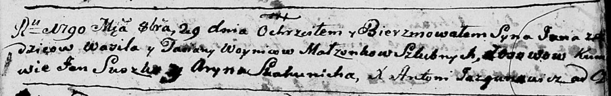

**Войнич Янка Василев (Woynicz Janka)**

18 октября 1793 г -- крещение (НИАБ 136-13-894, лист 20об, №73/1793-р
(коп)), (РГИА 823-2-18, лист 248об, №39/1793-р (коп)).

**НИАБ 136-13-894:** Лист 20-об. **Метрическая запись №73/1793-р
(ориг).**

{width="6.496527777777778in"
height="0.49148075240594924in"}

Дедиловичская Покровская церковь. 18 октября 1793 года. Метрическая
запись о крещении.

Woynicz Janka -- сын родителей с деревни Осовo.

Woynicz Wasil -- отец.

Woyniczowa Taсiana-- мать.

Suszko Jan - кум.

Skakunowa Ryna - кума.

Jazgunowicz Antoni -- ксёндз.

**РГИА 823-2-18:** Лист 248об. **Метрическая запись №40/1793-р (коп).**

{width="6.496527777777778in"
height="1.0777777777777777in"}

Дедиловичская Покровская церковь. \[18\] октября 1793 года. Метрическая
запись о крещении.

Woynicz Janka -- сын родителей с деревни Осово.

Woynicz Wasil -- отец.

Woyniczowa Tacianna -- мать.

Suszko Jan -- кум.

Skakunowa Aryna -- кума.

Jazgunowicz Antoni -- ксёндз.
