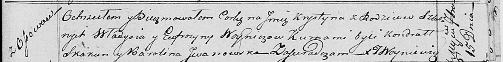

**Войнич Крыстына Владысева (Woyniczowna Krystyna)**

15 сентября 1818 г -- крещение (НИАБ 136-13-894, лист 99, №30/1818-р
(ориг)).

**НИАБ 136-13-894:** Лист 99. **Метрическая запись №30/1818-р (ориг).**

{width="6.496527777777778in"
height="0.8079593175853018in"}

Осовская Покровская церковь. 15 сентября 1818 года. Метрическая запись о
крещении.

Woyniczowna Krystyna -- дочь родителей с деревни Осовo.

Woynicz Władyś -- отец.

Woyniczowa Eufrozyna -- мать.

Skakun Kondrat -- кум.

Jwanjwska Karolina -- кума.

Woyniewicz Tomasz -- ксёндз.
