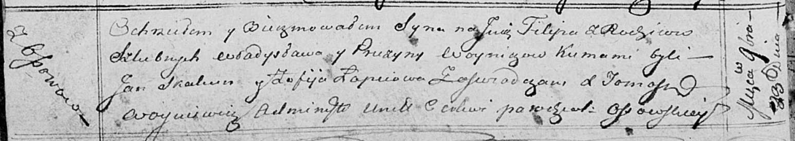

**Войнич Прузына, Ефрозына (Woyniczowa Pruzyna, Eufrozyna)**

23 ноября 1813 г -- крещение сына Филипа (НИАБ 136-13-894, лист 87об,
№40/1813-р (ориг)).

15 сентября 1818 г -- крещение дочери Крыстыны (НИАБ 136-13-894, лист
99, №30/1818-р (ориг)).

**НИАБ 136-13-894:** Лист 87об. **Метрическая запись №40/1813-р
(ориг).**

Осовская Покровская церковь. 23 ноября 1813 года. Метрическая запись о
крещении.

Woynicz Filip -- сын родителей с деревни Осовo.

Woynicz Władysław -- отец.

Woyniczowa Pruzyna -- мать.

Skakun Jan -- кум.

Łapciowa Zofija -- кума.

Woyniewicz Tomasz -- ксёндз.

**НИАБ 136-13-894:** Лист 99. **Метрическая запись №30/1818-р (ориг).**

Осовская Покровская церковь. 15 сентября 1818 года. Метрическая запись о
крещении.

Woyniczowna Krystyna -- дочь родителей с деревни Осовo.

Woynicz Władyś -- отец.

Woyniczowa Eufrozyna -- мать.

Skakun Kondrat -- кум.

Jwanjwska Karolina -- кума.

Woyniewicz Tomasz -- ксёндз.
