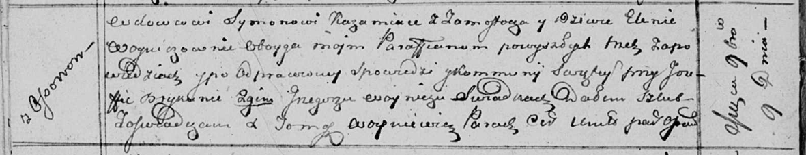

**Кожемяка (в девичестве Войнич) Елена (Każamiakowa Elena z Woyniczow)**

9 ноября 1813 г -- венчание с вдовцом Сымоном Кожемякой с деревни
Замосточье (НИАБ 136-13-920, лист 20об, №24/1813-б (ориг)).

**НИАБ 136-13-920:** Лист 20об. **Метрическая запись №24/1813-б
(ориг).**

Осовская Покровская церковь. 9 ноября 1813 года. Запись о венчании.

Każamiaka Symon -- жених, вдовец, парафии Осовской, с деревни
Замосточье.

Woyniczowna Elena -- невеста, девка, парафии Осовской, с деревни Осово.

Brykun Jozef -- свидетель.

Woynicz Grzegorz -- свидетель.

Woyniewicz Tomasz -- ксёндз.
