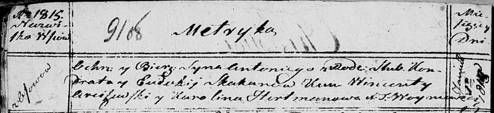

**Скакун (в девичестве Войнич) Евдокия (Skakunowa Eudokija z
Woyniczow)**

5 ноября 1811 г -- венчание с вдовцом Кондратом Скакуном с деревни Осово
(НИАБ 136-13-920, лист 17об, №7/1811-б (ориг)).

1 января 1813 г -- крещение дочери Виктории (НИАБ 136-13-894, лист 86,
№1/1813-р (ориг)).

1 января 1815 г -- крещение сына Антония (НИАБ 136-13-894, лист 91об,
№1/1815-р (ориг)).

1 апреля 1817 г -- крещение сына Габриэля (НИАБ 136-13-894, лист 96,
№24/1817-р (ориг)).

24 августа 1819 г -- крещение сына Тадея (НИАБ 136-13-894, лист 101об,
№47/1819-р (ориг)).

**НИАБ 136-13-920:** Лист 17об. **Метрическая запись №7/1811-б (ориг).**

{width="6.496527777777778in"
height="1.3537510936132984in"}

Осовская Покровская церковь. 5 ноября 1811 года. Метрическая запись о
венчании.

Skakun Kondrat -- жених, вдовец, парафии Осовской, с деревни Осово.

Woyniczowna Eudokija -- невеста, девка, парафии Осовской, с деревни
Осово.

Skakun Symon -- свидетель.

Kikiło Jan -- свидетель.

Woyniewicz Tomasz -- ксёндз.

**НИАБ 136-13-894:** Лист 86. **Метрическая запись №1/1813-р (ориг).**

{width="6.496527777777778in"
height="1.5374693788276466in"}

Осовская Покровская церковь. 1 января 1813 года. Метрическая запись о
крещении.

Skakunowna Wiktorija -- дочь родителей с деревни Осовo.

Skakun Kondrat -- отец.

Skakunowa Eudokija -- мать.

Arciszewski Wincenty, JP -- кум, шляхтич.

Hertmanowa Karolina, JP -- кума, шляхтянка.

Woyniewicz Tomasz -- ксёндз.

**НИАБ 136-13-894:** Лист 91об. **Метрическая запись №1/1815-р (ориг).**

{width="6.496527777777778in"
height="1.4905336832895888in"}

Осовская Покровская церковь. 1 января 1815 года. Метрическая запись о
крещении.

Skakun Antoni -- сын родителей с деревни Осовo.

Skakun Kondrat -- отец.

Skakunowa Eudokia -- мать.

Arciszewski Wincenty -- кум.

Hertmanowa Karolina -- кума.

Woyniewicz Tomasz -- ксёндз.

**НИАБ 136-13-894:** Лист 96. **Метрическая запись №24/1817-р (ориг).**

{width="6.496527777777778in"
height="1.092253937007874in"}

Осовская Покровская церковь. 1 апреля 1817 года. Метрическая запись о
крещении.

Skakun Gabriel -- сын родителей с деревни Осовo.

Skakun Kondrat -- отец.

Skakunowa Eudokija -- мать.

Arciszewski Xawier -- кум.

Jwanowska Karolina -- кума.

Woyniewicz Tomasz -- ксёндз.

**НИАБ 136-13-894:** Лист 101об. **Метрическая запись №47/1819-р
(ориг).**

{width="6.496527777777778in"
height="0.7596828521434821in"}

Осовская Покровская церковь. 24 августа 1819 года. Метрическая запись о
крещении.

Skakun Tadeusz -- сын родителей с деревни Осовo.

Skakun Kondrat -- отец.

Skakunowa Eudokija -- мать.

Arciszewski Wincenty, JP -- кум, шляхтич.

Jwanоwska ...lina -- кума.

Woyniewicz Tomasz -- ксёндз.
