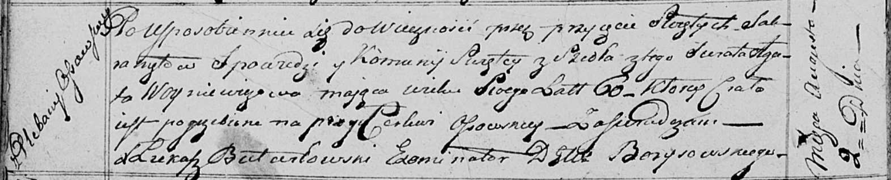

**Войнич Агата (Woyniczowa Agata)**

2 августа 1817 г -- отпевание, умерла в возрасте 60 лет (родилась около
1757 г) (НИАБ 136-13-919, лист 30об, №14/1817-у (ориг)).

**НИАБ 136-13-919:** Лист 30об. **Метрическая запись №14/1817-у
(ориг).**

Осовская униатская церковь. 2 августа 1817 года. Метрическая запись об
отпевании.

Woyniczowa Agata -- умершая, 60 лет, с плебании Осовской, с деревни
Осово, похоронена при церкви Осовской.

Woyniewicz Tomasz -- ксёндз.
