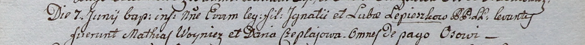

**Войнич Матей (Woynicz Mathias)**

7 июня 1800 г -- крестный отец Евы, дочери Игната и Любови Лепёшков с
деревни Осово (НИАБ 937-4-32, лист 2, №17/1800-р).

**НИАБ 937-4-32:** Лист 2. **Метрическая запись №17/1800-р.**

Дедиловичский костел Наисвятейшего Сердца Иисуса. 7 июня 1800 года.
Метрическая запись о крещении.

Lepioszka Eva -- дочь крестьян с деревни Осово.

Lepioszka Jgnati -- отец.

Lepioszkowa Luba -- мать.

Woynicz Mathias -- крестный отец, с деревни Осово.

Czeplajowa Daria -- крестная мать, с деревни Осово.

Linhart Hyacinthus -- ксёндз.
