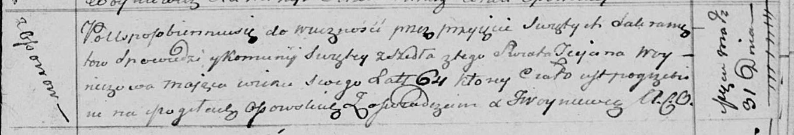

**Войнич Татьяна (Woyniczowa Taciana)**

31 марта 1814 г -- отпевание, умерла в возрасте 64 лет (родилась около
1750 г) (НИАБ 136-13-919, лист 28, №3/1814-у (ориг)).

**НИАБ 136-13-919:** Лист 28. **Метрическая запись №3/1814-у (ориг).**

Осовская униатская церковь. 31 марта 1814 года. Метрическая запись об
отпевании.

Woyniczowa Taciana -- умершая, 64 года, с деревни Осово, похоронена на
кладбище деревни Осово.

Woyniewicz Tomasz -- ксёндз.
