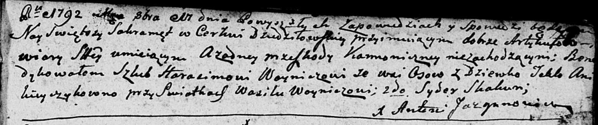
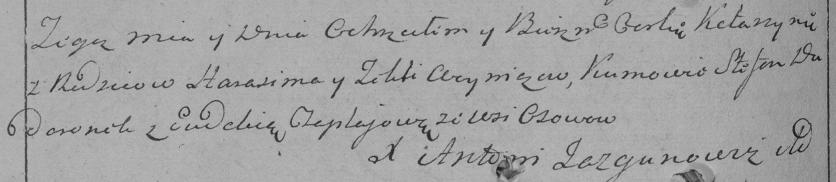
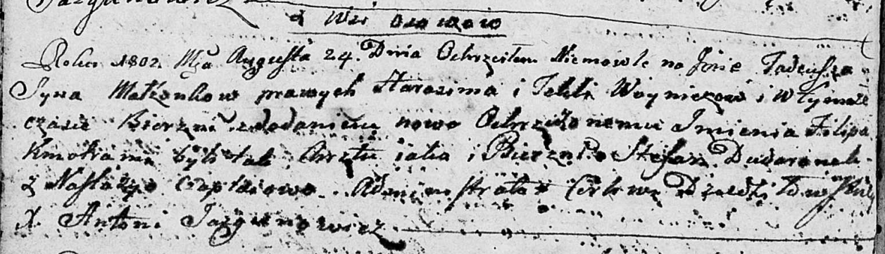
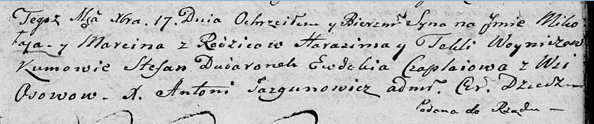
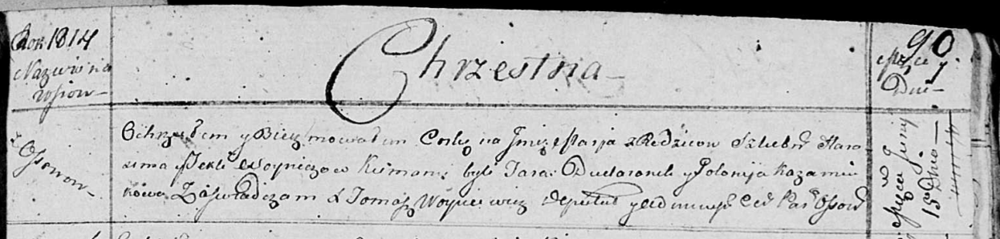

**Войнич Гарасим (Woynicz Harasim)**

11 октября 1792 г -- венчание с Теклей Аникейчик (НИАБ 136-13-894, лист
71, №10/1792-б (ориг)).

6 октября 1796 г -- крещение дочери Катерины (НИАБ 136-13-894, лист 31,
№92/1796-р (ориг)), (РГИА 823-2-18, лист 257об, №55/1796-р (коп)).

24 августа 1802 г -- крещение сына Тадея Филипа (НИАБ 136-13-894, лист
47об, №30/1802-р (ориг)).

17 декабря 1805 г -- крещение сына Миколая Марцина (НИАБ 136-13-894,
лист 59, №61/1805-р (ориг)).

11 ноября 1806 г -- крестный отец Винцентыя Викторыя, сына Лапецов
Василя и Ксени с деревни Осово (НИАБ 136-13-894, лист 61об, №49/1806-р
(ориг)).

15 июня 1814 г -- крещение дочери Марьи (НИАБ 136-13-894, лист 90,
№37/1814-р (ориг)).

**НИАБ 136-13-894:** Лист 71. **Метрическая запись №10/1792-б (ориг).**

Дедиловичская Покровская церковь. 11 октября 1792 года. Метрическая
запись о венчании.

Woynicz Harasim -- жених, с деревни Осово.

Anikieyczykowa Tekla -- невеста.

Woynicz Wasil -- свидетель.

Skakun Syder -- свидетель.

Jazgunowicz Antoni -- ксёндз.

**НИАБ 136-13-894:** Лист 31. **Метрическая запись №92/1796-р (ориг).**

Дедиловичская Покровская церковь. 6 октября 1796 года. Метрическая
запись о крещении.

Woyniczowna Katerzyna -- дочь родителей с деревни Осовo.

Woynicz Harasim -- отец.

Woyniczowa Tekla -- мать.

Dudaronek Stefan -- кум.

Czaplajowa Ewdokija - кума.

Jazgunowicz Antoni -- ксёндз.

**РГИА 823-2-18:** Лист 257об. **Метрическая запись №55/1796-р (коп).**

Дедиловичская Покровская церковь. \[6\] октября 1796 года. Метрическая
запись о крещении.

Woyniczowna Katarzyna -- дочь родителей с деревни Осово.

Woynicz Harasim -- отец.

Woyniczowa Tekla -- мать.

Dudaronok Stefan -- кум.

Czaplajowa Ewdokia -- кума.

Jazgunowicz Antoni -- ксёндз.

**НИАБ 136-13-894:** Лист 47об. **Метрическая запись №30/1802-р
(ориг).**

Дедиловичская Покровская церковь. 24 августа 1802 года. Метрическая
запись о крещении.

Woynicz Tadeusz Filip -- сын родителей с деревни Осовo.

Woynicz Harasim -- отец.

Woyniczowa Tekla -- мать.

Dudaronek Stefan -- кум.

Czaplaiowa Nastazyja -- кума.

Jazgunowicz Antoni -- ксёндз.

**НИАБ 136-13-894:** Лист 59. **Метрическая запись №61/1805-р (ориг).**

Дедиловичская Покровская церковь. 17 декабря 1805 года. Метрическая
запись о крещении.

Woynicz Mikołay Marcin -- сын родителей с деревни Осовo.

Woynicz Harasim -- отец.

Woyniczowa Tekla -- мать.

Dudaronek Stefan -- кум.

Czaplaiowa Ewdokija -- кума.

Jazgunowicz Antoni -- ксёндз.

**НИАБ 136-13-894:** Лист 61об. **Метрическая запись №49/1806-р
(ориг).**

Дедиловичская Покровская церковь. 11 ноября 1806 года. Метрическая
запись о крещении.

Łapać Wincenty Wiktory -- сын родителей с деревни Осовo.

Łapać Wasil -- отец.

Łapaciowa Xienia -- мать.

Woynicz Harasim -- кум, с деревни Осовo.

Skakunowa Małania -- кума, с деревни Осовo.

Jazgunowicz Antoni -- ксёндз.

**НИАБ 136-13-894:** Лист 90. **Метрическая запись №37/1814-р (ориг).**

Осовская Покровская церковь. 15 июня 1814 года. Метрическая запись о
крещении.

Woyniczowna Marja -- дочь родителей с деревни Осовo.

Woynicz Harasim -- отец.

Woyniczowa Tekla -- мать.

Dudaronek Taras -- кум.

Każamiakowa Polonija -- кума.

Woyniewicz Tomasz -- ксёндз.
