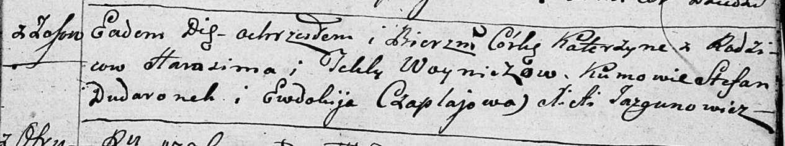

**Войнич Катерына Гарасимова (Woyniczowna Katerzyna)**

6 октября 1796 г -- крещение (НИАБ 136-13-894, лист 31, №92/1796-р
(ориг)), (РГИА 823-2-18, лист 257об, №55/1796-р (коп)).

**НИАБ 136-13-894:** Лист 31. **Метрическая запись №92/1796-р (ориг).**

Дедиловичская Покровская церковь. 6 октября 1796 года. Метрическая
запись о крещении.

Woyniczowna Katerzyna -- дочь родителей с деревни Осовo.

Woynicz Harasim -- отец.

Woyniczowa Tekla -- мать.

Dudaronek Stefan -- кум.

Czaplajowa Ewdokija - кума.

Jazgunowicz Antoni -- ксёндз.

**РГИА 823-2-18:** Лист 257об. **Метрическая запись №55/1796-р (коп).**

Дедиловичская Покровская церковь. \[6\] октября 1796 года. Метрическая
запись о крещении.

Woyniczowna Katarzyna -- дочь родителей с деревни Осово.

Woynicz Harasim -- отец.

Woyniczowa Tekla -- мать.

Dudaronok Stefan -- кум.

Czaplajowa Ewdokia -- кума.

Jazgunowicz Antoni -- ксёндз.
