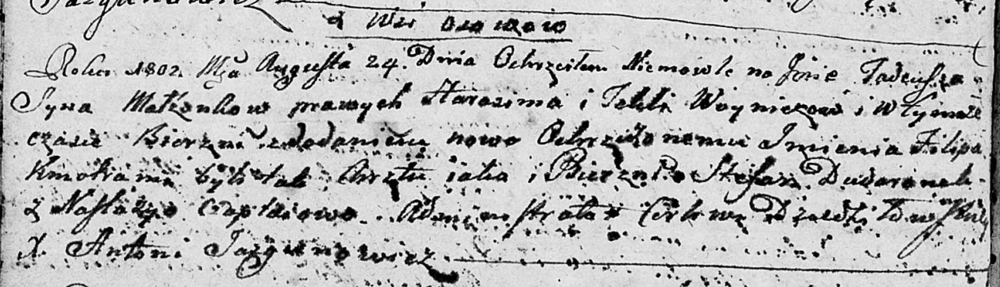

**Войнич Тадей Гарасимов (Woynicz Tadeusz Filip)**

24 августа 1802 г -- крещение (НИАБ 136-13-894, лист 47об, №30/1802-р
(ориг)).

**НИАБ 136-13-894:** Лист 47об. **Метрическая запись №30/1802-р
(ориг).**

Дедиловичская Покровская церковь. 24 августа 1802 года. Метрическая
запись о крещении.

Woynicz Tadeusz Filip -- сын родителей с деревни Осовo.

Woynicz Harasim -- отец.

Woyniczowa Tekla -- мать.

Dudaronek Stefan -- кум.

Czaplaiowa Nastazyja -- кума.

Jazgunowicz Antoni -- ксёндз.
