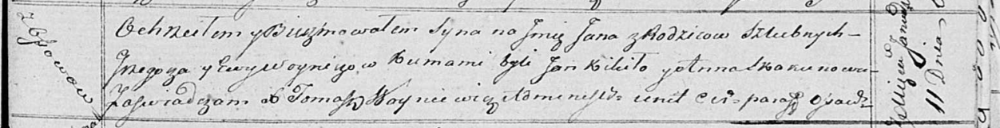

**Войнич (в девичестве Скакун) Ева (Woyniczowa Ewa z Skakunow)**

11 ноября 1809 г -- венчание с Грыгором Войничем с деревни Осово (НИАБ
136-13-920, лист 16, №22/1809-б (ориг)).

22 марта 1814 г -- крещение дочери Марии (НИАБ 136-13-894, лист 89,
№16/1814-р (ориг)).

27 мая 1817 г -- крещение сына Тараса (НИАБ 136-13-894, лист 96об,
№36/1817-р (ориг)).

11 января 1819 г -- крещение сына Яна (НИАБ 136-13-894, лист 100,
№2/1819-р (ориг)).

**НИАБ 136-13-920:** Лист 16. **Метрическая запись №22/1809-б (ориг).**

Дедиловичская Покровская церковь. 11 ноября 1809 года. Метрическая
запись о венчании.

Woynicz Hryhor -- жених, с деревни Осовo.

Skakunowa Ewa -- невеста, девка с деревни Осовo.

Skakun Symon -- свидетель.

Skakun Janka -- свидетель, с деревни Осовo.

Jazgunowicz Antoni -- ксёндз.

**НИАБ 136-13-894:** Лист 89. **Метрическая запись №16/1814-р (ориг).**

Осовская Покровская церковь. 22 марта 1814 года. Метрическая запись о
крещении.

Woyniczowna Maria -- дочь родителей с деревни Осовo.

Woynicz Grzegorz -- отец.

Woyniczowa Ewa -- мать.

Kikiło Jan -- кум.

Skakunowa Anna -- кума.

Woyniewicz Tomasz -- ксёндз.

**НИАБ 136-13-894:** Лист 96об. **Метрическая запись №36/1817-р
(ориг).**

Осовская Покровская церковь. 27 мая 1817 года. Метрическая запись о
крещении.

Woynicz Taras -- сын родителей с деревни Осовo.

Woynicz Grzegorz -- отец.

Woyniczowa Ewa -- мать.

Kikiło Jan -- кум.

Skakunowa Anna -- кума.

Woyniewicz Tomasz -- ксёндз.

**НИАБ 136-13-894:** Лист 100. **Метрическая запись №2/1819-р (ориг).**

Осовская Покровская церковь. 11 января 1819 года. Метрическая запись о
крещении.

Woynicz Jan -- сын родителей с деревни Осовo.

Woynicz Grzegorz -- отец.

Woyniczowa Ewa -- мать.

Kikiło Jan -- кум.

Skakunowa Anna -- кума.

Woyniewicz Tomasz -- ксёндз.
