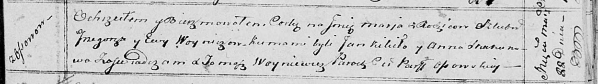

**Войнич Мария Грыгорова (Woyniczowna Maria)**

22 марта 1814 г -- крещение (НИАБ 136-13-894, лист 89, №16/1814-р
(ориг)).

6 декабря 1817 г -- отпевание, умерла в возрасте 4 лет (НИАБ 136-13-919,
лист 91, №23/1817-у (ориг)).

**НИАБ 136-13-894:** Лист 89. **Метрическая запись №16/1814-р (ориг).**

{width="6.496527777777778in"
height="0.9159109798775154in"}

Осовская Покровская церковь. 22 марта 1814 года. Метрическая запись о
крещении.

Woyniczowna Maria -- дочь родителей с деревни Осовo.

Woynicz Grzegorz -- отец.

Woyniczowa Ewa -- мать.

Kikiło Jan -- кум.

Skakunowa Anna -- кума.

Woyniewicz Tomasz -- ксёндз.

**НИАБ 136-13-919:** Лист 31. **Метрическая запись №23/1817-у (ориг).**

{width="6.496527777777778in"
height="0.6763888888888889in"}

Осовская униатская церковь. 6 декабря 1817 года. Метрическая запись об
отпевании.

Woyniczowa Marya -- умершая, 4 года, с деревни Осово, похоронена на
кладбище деревни Осово.

Woyniewicz Tomasz -- ксёндз.
