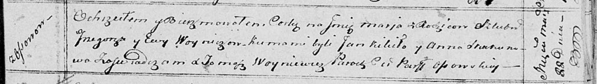

**Войнич Ян Грыгоров (Woynicz Jan)**

11 января 1819 г -- крещение (НИАБ 136-13-894, лист 100, №2/1819-р
(ориг)).

**НИАБ 136-13-894:** Лист 100. **Метрическая запись №2/1819-р (ориг).**

{width="6.496527777777778in"
height="0.8354494750656168in"}

Осовская Покровская церковь. 11 января 1819 года. Метрическая запись о
крещении.

Woynicz Jan -- сын родителей с деревни Осовo.

Woynicz Grzegorz -- отец.

Woyniczowa Ewa -- мать.

Kikiło Jan -- кум.

Skakunowa Anna -- кума.

Woyniewicz Tomasz -- ксёндз.
