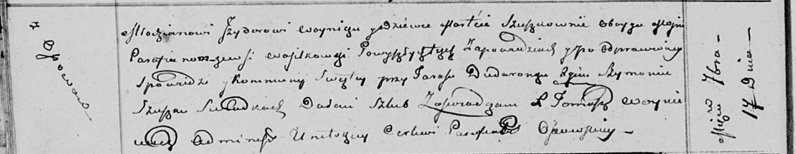

**Войнич Изыдор (Woynicz Jzydor)**

17 сентября 1811 г -- венчание с девкой Мартой Сушко (НИАБ 136-13-920,
лист 17об, №5/1811-б (ориг))

**НИАБ 136-13-920:** Лист 17об. **Метрическая запись №5/1811-б (ориг).**

Осовская Покровская церковь. 17 сентября 1811 года. Метрическая запись о
венчании.

Woynicz Jzydor -- жених, молодой, парафии Осовской, с деревни Осово,
Васильковка?.

Szuszkowna Marta -- невеста, девка, парафии Осовской, с деревни
Васильковка?.

Dudaronek Taras -- свидетель.

Szuszko Szymon -- свидетель.

Woyniewicz Tomasz -- ксёндз.
